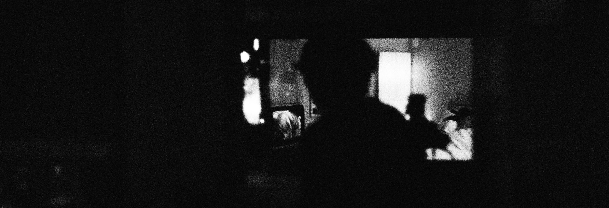

I am an experimental filmmaker, projectionist and lecturer in artistic research. I am interested in analogue filmmaking as artistic practice and emancipatory aesthetic politics, in open source technology and the ethics of sharing. I programmed this homepage myself with the open-source program jekyll, please enjoy all its flaws!

If you want to get in touch, write me a <a href="mailto:lostlostlost@posteo.net">mail</a>

 

# News

2023-12-12 <strong>Screening:</strong> Trailer: Freies Kino, Stadtkino Künstlerhaus

2023-12-07 <strong>Screening:</strong> Earth Water Motor II, K3 Film Festival

2023-11-25 <strong>Screening:</strong> Earth Water Motor II, Festival Cinemistica

2023-11-21 <strong>Screening:</strong> Earth Water Motor II, Freies Kino im Stadtkino Künstlerhaus

2022-11-11 <strong>Vernissage:</strong> Cosmic Noise 4:3, Video Installation, Vienna Art Week/Creative Cluster

2023-11-10 <strong>Screening:</strong> Earth Water Motor II, Experimental Superstars

2023-11-03 <strong>Screening:</strong> Earth Water Motor II, Engauge Experimental Film Festival

2023-10-26 <strong>Screening:</strong> Earth Water Motor II, Bideodromo International Experimental Film and Video Festival

2023-10-13 <strong>Teaching:</strong> "Handmade Cinema: Photochemischer Film im digitalen Zeitalter", Seminar, University of Klagenfurt

2023-09-08 <strong>Talk:</strong> "Lo-Fi, High-Contrast. Hand-made Film Ecologies and the Material Body of Analog Film", Visible Evidence Conference, Film Forum Udine

2023-06-05 <strong>Screening:</strong> Earth Water Motor II, Vienna Shorts Film Festival

2023-05-17 <strong>Teaching:</strong> 16mm Filmmaking Workshop, University of Applied Arts Vienna

2023-04-02 <strong>Screening:</strong> I am not there, Analog Mania

2023-04-01 <strong>Vernissage:</strong> The Aesthetics of Disappearance, Video Installation, Analog Mania

2023-02-06 <strong>Vernissage:</strong> Memory Series, Video Installation, Galerie Kras

2023-01-23 <strong>Talk:</strong> "Arbeiten mit analogem Film" mit T. Covi, R. Frimmel u. I. Brunäcker, Stadtkino Wien

2023-01-21 <strong>Screening:</strong> Earth Water Motor II, Rundgang AK Bildende

2023-01-16 <strong>Talk:</strong> Artist Talk, Friedl Kubelka Schule für unabhängigen Film

2022-12-16 <strong>Screening:</strong> Memory Series, K3 Film Festival

2022-12-14 <strong>Premiere:</strong> K3 Trailer, K3 Film Festival

2022-11-26 <strong>Vernissage:</strong> Lichtbild 4:3, Super8 Projector Installation, Kultuhof Villach

2022-11-23 <strong>Screening:</strong> Into the Wild, Istanbul International Experimental Film Festival

2022-11-19 <strong>Vernissage:</strong> Super8TV, Video Installation, Vienna Art Week/Creative Cluster

2022-11-10 <strong>Screening:</strong> Mountain View, Analogica

2022-11-09 <strong>Screening:</strong> As you are coming closer, Festival de Sevilla

2022-11-04 <strong>filmkoop wien re-opening</strong>

2022-11-04 <strong>Screening/Curated:</strong> Blätter im Herbst, GROW II, Blickle Kino

2022-11-02 <strong>Screening:</strong> Mountain View, Engauge Experimental Film Festival

2022-10-20 <strong>Screening:</strong> Memory Series, Antimatter [Media Art]

2022-10-13 <strong>Screening:</strong> Mountain View, ULTRAcinema

2022-08-20 <strong>Screening/Curated:</strong> Into the Wild / 10 megabytes of memory, Waldarena Krumpendorf

2022-07-26 <strong>Screening:</strong> As you are coming closer, Syros International Film Festival (SIFF)

2022-07-09 <strong>Screening:</strong> Blätter im Herbst, Dresdner Schmalfilmtage

2022-07-01 <strong>Grant/Residency:</strong> 3-month filmmaking grant, Cultural Commission Carinthia

2022-06-29 <strong>Talk:</strong> PhD Research Presentation, Channel Clayton, Angewandte Wien

2022-06-14 <strong>Residency:</strong> Medienfrische Tirol/Bschlabertal

2022-05-26 <strong>Screening:</strong> 10 megabytes of memory, Split Videoart Festival

2022-05-26 <strong>Screening:</strong> 10 megabytes of memory, Vienna Shorts Film Festival

2022-05-13 <strong>Workshop:</strong> Die Kino Maschine, Österreichisches Filmmuseum

2022-04-10 <strong>Screening:</strong> Into the Wild, Peripheries

2022-04-09 <strong>Screening:</strong> Memory Series, Diagonale

2022-03-25 <strong>Screening:</strong> 10 megabytes of memory, Under the Radar

2022-05-02 <strong>Screening:</strong> Mountain View / Into the Wild, Metrokino Kulturhaus

2021-12-10 <strong>Screening:</strong> Into the Wild, Harkat 16mm Film Festival

2021-12-10 <strong>Screening:</strong> Into the Wild, Kinoskop - Analog Experimental Film Festival

2021-11-05 <strong>Screening:</strong> Into the Wild, Chicago Underground Film Festival

2021-10-16 <strong>Screening:</strong> 10 megabytes of memory / Into the Wild, Tranas at the Fringe

2021-08-01 <strong>Screening:</strong> Into the Wild, Bogotá Experimental Film Festival / CineAutopsia

2021-06-12 <strong>Screening:</strong> Into the Wild, Diagonale

2021-05-27 <strong>Screening:</strong> Into the Wild, Vienna Shorts Film Festival

2020 Archived

2019 Archived

2018 Archived

2017 Archived

<!-- # Blog



<a href="{{ post.url }}">{{post.title}}</a> 

 -->